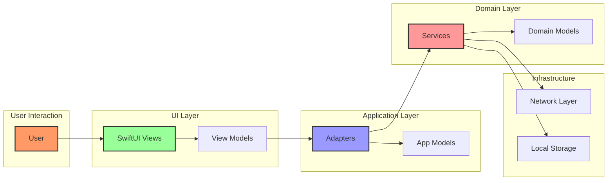
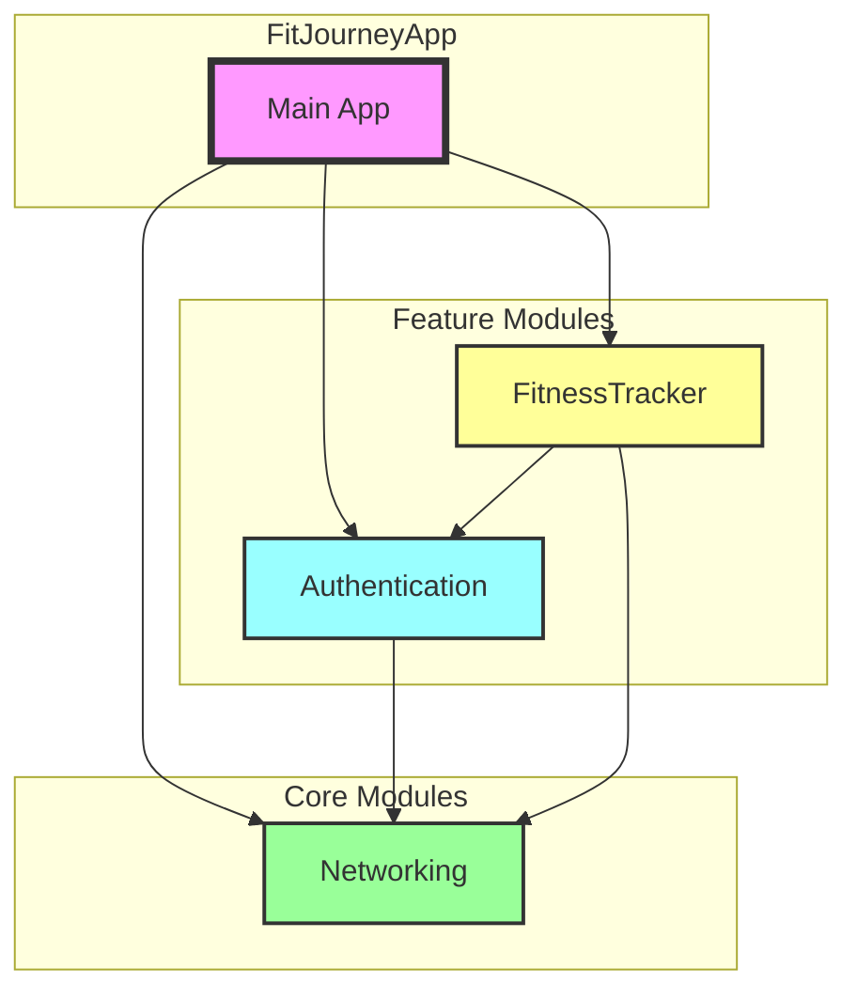
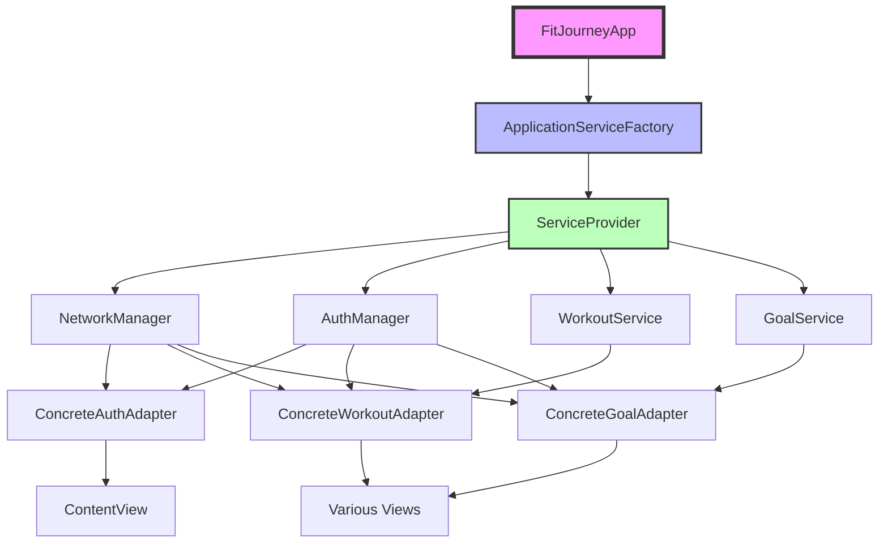

# FitJourneyApp Dependency Graph

This document visualizes the dependency relationships in the FitJourneyApp architecture.

## High-Level Architecture

```mermaid
graph TB
    subgraph "FitJourneyApp (Main App)"
        App[FitJourneyApp.swift]
        ContentView[ContentView]
        MainTabView[MainTabView]
        ServiceFactory[ApplicationServiceFactory]
        ServiceProvider[ServiceProvider]
    end

    subgraph "Views Layer"
        DashboardView[DashboardView]
        BenefitView[BenefitView]
        ProfileView[ProfileView]
        
        subgraph "Dashboard Components"
            WorkoutCard[WorkoutCard]
            GoalProgressCard[GoalProgressCard]
            SummaryCard[SummaryCard]
            EmptyStateView[EmptyStateView]
            CompletedGoalsView[CompletedGoalsView]
        end
        
        subgraph "Benefit Components"
            QuickStatsView[QuickStatsView]
            StatItem[StatItem]
        end
    end

    subgraph "Navigation"
        NavigationRouter[NavigationRouter]
        ViewExtensions[View+Navigation]
    end

    subgraph "View Models"
        AuthStateObserver[AuthStateObserver]
    end

    subgraph "Adapters Layer"
        AppAdapters[ApplicationAdapters]
        ConcreteAdapters[ConcreteAdapters]
        WorkoutDetailLoader[WorkoutDetailLoader]
        GoalDetailLoader[GoalDetailLoader]
    end

    subgraph "External Modules"
        subgraph "Authentication Module"
            AuthManager[AuthManager]
            AuthViewModel[AuthViewModel]
            AuthView[AuthView]
            SignInView[SignInView]
            SignUpView[SignUpView]
        end
        
        subgraph "FitnessTracker Module"
            WorkoutViewModel[WorkoutViewModel]
            GoalViewModel[GoalViewModel]
            WorkoutsView[WorkoutsView]
            GoalsView[GoalsView]
            WorkoutDetailView[WorkoutDetailView]
            GoalDetailView[GoalDetailView]
            AddWorkoutView[AddWorkoutView]
            AddGoalView[AddGoalView]
        end
        
        subgraph "Networking Module"
            NetworkManager[NetworkManager]
        end
    end

    %% Main App Dependencies
    App --> ServiceFactory
    App --> AuthStateObserver
    App --> NavigationRouter
    App --> ContentView
    
    ServiceFactory --> ServiceProvider
    ServiceProvider --> ConcreteAdapters
    
    ContentView --> MainTabView
    ContentView --> AuthStateObserver
    
    MainTabView --> DashboardView
    MainTabView --> BenefitView
    MainTabView --> ProfileView
    MainTabView --> NavigationRouter
    
    %% Dashboard Dependencies
    DashboardView --> WorkoutCard
    DashboardView --> GoalProgressCard
    DashboardView --> SummaryCard
    DashboardView --> EmptyStateView
    DashboardView --> CompletedGoalsView
    DashboardView --> NavigationRouter
    
    %% Benefit Dependencies
    BenefitView --> QuickStatsView
    BenefitView --> NavigationRouter
    QuickStatsView --> StatItem
    
    %% Adapter Dependencies
    ConcreteAdapters --> AuthManager
    ConcreteAdapters --> WorkoutViewModel
    ConcreteAdapters --> GoalViewModel
    ConcreteAdapters --> NetworkManager
    
    %% Loader Dependencies
    WorkoutDetailLoader --> WorkoutDetailView
    GoalDetailLoader --> GoalDetailView
    
    %% Auth Dependencies
    AuthView --> SignInView
    AuthView --> SignUpView
    AuthView --> AuthViewModel
    AuthViewModel --> AuthManager
    
    %% FitnessTracker Dependencies
    WorkoutsView --> WorkoutViewModel
    WorkoutsView --> AddWorkoutView
    GoalsView --> GoalViewModel
    GoalsView --> AddGoalView
    GoalDetailView --> GoalViewModel
    
    %% State Observer
    AuthStateObserver --> AppAdapters

    style App fill:#f9f,stroke:#333,stroke-width:4px
    style ServiceFactory fill:#bbf,stroke:#333,stroke-width:2px
    style NavigationRouter fill:#bfb,stroke:#333,stroke-width:2px
    style ConcreteAdapters fill:#fbf,stroke:#333,stroke-width:2px
```

## Data Flow

## Module Dependencies

## Key Architectural Patterns

1. **Adapter Pattern**: The app uses adapters to bridge between domain modules and the UI layer
2. **Factory Pattern**: `ServiceFactory` and `ServiceProvider` create and manage service instances
3. **Observer Pattern**: `AuthStateObserver` monitors authentication state changes
4. **Router Pattern**: `NavigationRouter` handles app-wide navigation
5. **MVVM Pattern**: Views are backed by ViewModels that manage state and business logic

## Dependency Injection Flow

